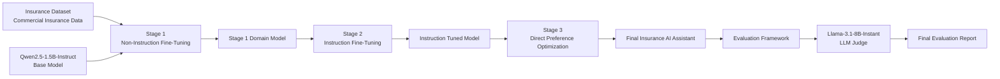

# Insurance AI Assistant Fine-Tuning Project

## Contents

1. Project Title
2. Domain Selected
3. Business Problem
4. Architecture
5. Dataset Details
6. Model Used
7. Non-Instruction Fine-Tuning Approach
8. Instruction Fine-Tuning Approach
9. DPO Alignment Approach
10. LoRA / QLoRA Configuration
11. Training Screenshots or Logs
12. Before vs After Output Comparison
13. Final Observations
14. Challenges Faced
15. Future Improvements
16. Important Links
17. Conclusion

---

# 1. Project Title

**Insurance AI Assistant Using QLoRA, Instruction Fine-Tuning, and DPO Alignment**

---

# 2. Domain Selected

## Commercial Insurance & Underwriting

This project focuses on building an AI-powered insurance assistant capable of answering underwriting, risk assessment, policy evaluation, and insurance-related business questions.

The objective was to adapt a foundation Large Language Model (LLM) to understand insurance-specific terminology, underwriting guidelines, risk management concepts, and respond professionally to users.

---

# 3. Business Problem

Insurance professionals spend significant time reviewing submissions, analyzing risks, interpreting policy requirements, and answering repetitive underwriting questions.

## Challenges

- Manual review of insurance submissions
- Inconsistent underwriting responses
- Slow turnaround time
- Knowledge dependency on experienced underwriters
- Limited accessibility to insurance expertise

## Project Goal

Develop an Insurance AI Assistant capable of:

- Understanding insurance terminology
- Providing underwriting guidance
- Assisting with risk evaluation
- Answering insurance-related questions
- Producing professional and consistent responses

---

# 4. Architecture

## Solution Architecture



## Training Pipeline

```text
Insurance Dataset
        │
        ▼
Qwen2.5-1.5B-Instruct
        │
        ▼
Non-Instruction Fine-Tuning
        │
        ▼
Instruction Fine-Tuning
        │
        ▼
DPO Alignment
        │
        ▼
Final Insurance AI Assistant
```

## Evaluation Pipeline

```text
Base Model
          \
Stage 1 Model \
               \
Stage 2 Model -----> Llama-3.1-8B-Instant Judge Model
               /
Stage 3 Model /
             /
            ▼

      Evaluation Report
```

### Architecture Explanation

1. Commercial insurance data was collected and transformed into training datasets.
2. Qwen2.5-1.5B-Instruct was selected as the base model.
3. QLoRA was used for parameter-efficient fine-tuning.
4. Stage 1 introduced domain-specific insurance knowledge through Non-Instruction Fine-Tuning.
5. Stage 2 improved instruction-following capability using Instruction Fine-Tuning.
6. Stage 3 aligned model responses using Direct Preference Optimization (DPO).
7. The final model was evaluated against all previous stages.
8. Llama-3.1-8B-Instant was used as an independent LLM Judge to score and compare responses.
9. Evaluation results were compiled into a final comparison report.

---

# 5. Dataset Details

## Dataset Type

Custom Commercial Insurance Dataset (PDF & JSON)

## Data Sources

The dataset was created using domain-specific insurance and underwriting content covering:

- Commercial insurance
- Risk assessment
- Workers compensation
- Property insurance
- Liability coverage
- Middle market underwriting
- Submission requirements
- Risk mitigation practices
- Insurance operations

## Dataset Transformation Stages

### Stage 1 Dataset

Non-instruction insurance knowledge dataset.

**Format**

- Question
- Answer

### Stage 2 Dataset

Instruction-following dataset.

**Format**

- Instruction
- Input
- Response

### Stage 3 Dataset

Preference dataset for DPO training.

**Format**

- Prompt
- Chosen Response
- Rejected Response

---

# 6. Model Used

## Base Model

**Qwen2.5-1.5B-Instruct**

The model was selected because:

- Lightweight and efficient for fine-tuning
- Strong instruction-following capabilities
- Suitable for QLoRA-based training
- Works effectively within Google Colab GPU limitations
- Provides a good balance between performance and computational cost

## Judge Model

**Llama-3.1-8B-Instant**

The judge model was used during the evaluation phase to compare responses from:

- Base Model
- Non-Instruction Fine-Tuned Model
- Instruction Fine-Tuned Model
- DPO Fine-Tuned Model

Evaluation criteria included:

- Correctness
- Completeness
- Domain Accuracy
- Professional Quality
- Helpfulness

---

# 7. Non-Instruction Fine-Tuning Approach

## Objective

Teach the model insurance domain knowledge.

## Method

The model was trained on insurance-related question and answer pairs without explicit instruction formatting.

## Outcome

The model learned:

- Insurance terminology
- Underwriting concepts
- Risk assessment language
- Commercial insurance knowledge

However, response structure and instruction-following capability remained limited.

---

# 8. Instruction Fine-Tuning Approach

## Objective

Improve the model's ability to follow user instructions and provide structured responses.

## Method

Training examples were converted into instruction-response format.

## Outcome

The model became better at:

- Understanding user intent
- Providing structured answers
- Maintaining conversational format
- Producing professional responses

---

# 9. DPO Alignment Approach

## DPO

**Direct Preference Optimization**

## Objective

Improve answer quality by learning user preferences.

## Approach

The model learns which response is preferred and adjusts its behavior accordingly.

## Outcome

The model generated:

- More helpful answers
- Better clarity
- Better professionalism
- Reduced hallucinations
- Improved alignment with expected insurance responses

---

# 10. LoRA / QLoRA Configuration

## Fine-Tuning Technique

**QLoRA**

QLoRA was selected because it enables efficient fine-tuning on limited GPU resources by loading the model in 4-bit precision while training LoRA adapters.

### Parameters Used

#### Rank (r = 16)

Controls adapter capacity. Higher rank increases learning capability but also increases memory usage.

#### Alpha (lora_alpha = 32)

Controls how strongly LoRA adapters influence the base model.

#### Dropout (lora_dropout = 0.05)

Helps reduce overfitting during training.

#### Learning Rate (learning_rate = 2e-4)

Enables learning of insurance-specific knowledge while preserving the base model's capabilities.

#### Batch Size (per_device_train_batch_size = 2)

Selected based on available GPU memory in Google Colab.

---

# 11. Training Screenshots or Logs

Refer to training logs:

https://github.com/Pzazz55/insurance-ai-assistant-finetuning/tree/main/reports

---

# 12. Before vs After Output Comparison

Refer to the final evaluation report:

https://github.com/Pzazz55/insurance-ai-assistant-finetuning/blob/main/reports/final_evaluation_20260710_025732.pdf

---

# 13. Final Observations

## Key Findings

- Domain adaptation significantly improved insurance knowledge.
- Instruction tuning improved response structure.
- DPO alignment improved response quality and professionalism.
- QLoRA enabled efficient training on limited hardware.
- Preference optimization produced the most consistent and useful outputs.

---

# 14. Challenges Faced

## Technical Challenges

- Limited GPU memory in Google Colab
- Token length limitations
- Parsing large evaluation reports
- Managing multiple training stages
- DPO dataset creation and validation
- Consistent evaluation across model checkpoints

## Solutions

- Used QLoRA for memory efficiency
- Applied truncation strategies
- Built automated evaluation pipelines
- Implemented model comparison frameworks

---

# 15. Future Improvements

## Planned Enhancements

### 1. Retrieval Augmented Generation (RAG)

Integrate:

- Underwriting manuals
- Policy documents
- Regulatory references

### 2. Insurance Knowledge Base

Create a searchable repository of insurance documents.

### 3. Vector Database Integration

Implement vector databases such as:

- FAISS
- ChromaDB
- Pinecone

### 4. Multi-Agent Architecture

Develop specialized agents:

- Underwriting Agent
- Claims Agent
- Risk Assessment Agent
- Compliance Agent

### 5. Web Application

Convert the solution into an interactive application using:

- Streamlit
- Gradio
- FastAPI

### 6. Continuous Preference Learning

Expand DPO datasets using production feedback and user interactions.

---

# 16. Important Links

- GitHub Repository: https://github.com/Pzazz55/insurance-ai-assistant-finetuning/tree/main
- Hugging Face Profile: https://huggingface.co/Pzazz55

---

# Conclusion

This project successfully developed a domain-adapted Insurance AI Assistant through a three-stage fine-tuning pipeline consisting of:

1. Non-Instruction Fine-Tuning
2. Instruction Fine-Tuning
3. DPO Preference Alignment

Using QLoRA enabled efficient training on limited GPU resources while achieving strong performance in commercial insurance and underwriting tasks. The final DPO-aligned model demonstrated the highest quality, professionalism, and user alignment among all evaluated model versions.
